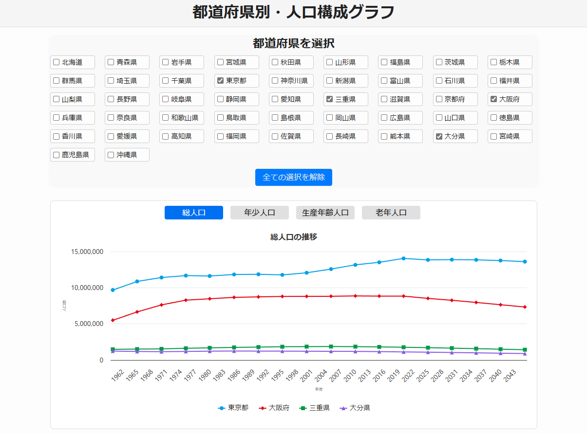
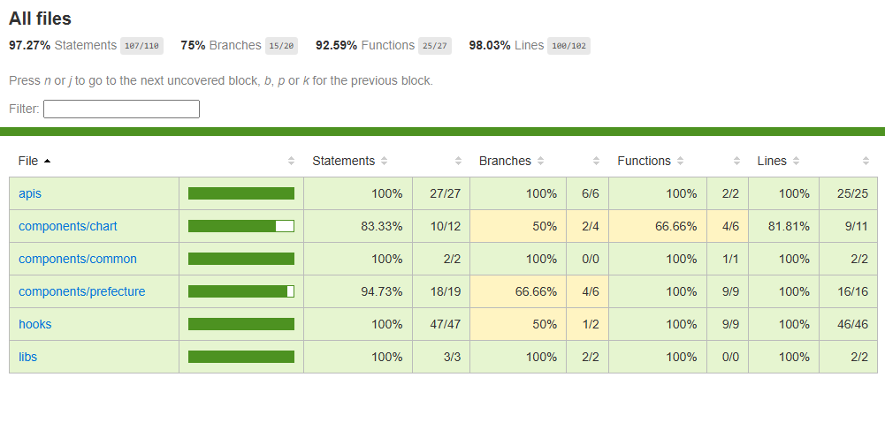

### こちらは課題レポートへのリンクです： [`report.md`](./report.md)

---

# 都道府県別・人口構成グラフアプリ

本アプリは、株式会社ゆめみのフロントエンドエンジニア・コーディング課題に基づいて実装された、都道府県ごとの人口構成を可視化する Web アプリケーションです。

<p align="center">
  
</p>

## 機能概要

- ✅ 都道府県一覧をチェックボックスで選択
- ✅ 総人口・年少人口・生産年齢人口・老年人口の切り替え表示
- ✅ Highcharts を用いた人口推移グラフの描画
- ✅ キャッシュ機能による API 通信の最適化
- ✅ レスポンシブ対応済み
- ✅ Tokyo（13）と Osaka（27）を初期選択状態で表示

---

## デプロイ先

- URL: [都道府県別・人口構成グラフ](https://yumemi-frontend-test-nine.vercel.app/)

---

## 技術スタック

| 項目           | 使用技術                                   |
| -------------- | ------------------------------------------ |
| フレームワーク | Next.js 15 (App Router)                    |
| 言語           | TypeScript                                 |
| グラフ描画     | Highcharts                                 |
| UIライブラリ   | なし（SCSSモジュールを手動設計）           |
| 状態管理       | React Hooks (useState, useEffect, useRef)  |
| API層          | Axios + 型定義分離（`apis/` ディレクトリ） |
| フック構成     | `usePrefectures`, `usePopulationData`      |
| テスト         | Jest + React Testing Library               |
| CI/CD          | GitHub Actions + Vercel                    |

---

## ディレクトリ構成（抜粋）

```
src/
├── apis/                 # API呼び出し関連と型定義
├── components/           # UIコンポーネント群
│   ├── chart/            # グラフ関連（Chart, Container）
│   ├── layout/           # レイアウト（AppLayout）
│   └── prefecture/       # 都道府県選択UI
├── hooks/                # カスタムフック（API取得用）
├── __tests__/            # 単体テスト
│   ├── apis/             # API層のテスト
│   ├── components/       # UIコンポーネントテスト
│   └── hook/             # カスタムフックのテスト
├── styles/               # SCSS モジュール
└── pages/ or app/        # AppRouter によるルート定義
```

---

## テストについて

- APIのユニットテスト（キャッシュ挙動含む）
- カスタムフックのロジックテスト（エラー処理、初期取得など）
- UIコンポーネントの描画テスト（Chart、Checkboxなど）
- 共通コンポーネント（Loading）の単体テスト

カバレッジ取得は以下で実行可能：

```bash
npm run test:coverage
```

- カバレッジレポートのプレビュー。

<p align="center">
  
</p>

---

## セットアップ手順

```bash
git clone https://github.com/your-name/your-repo.git
cd your-repo
npm install
```

### 環境変数の設定

1. プロジェクトのルートディレクトリに `.env` ファイルを作成
2. 以下の内容を追加:

```
NEXT_PUBLIC_API_KEY=<APIキー>
```

### 開発サーバーの起動

```bash
npm run dev
```

---

## お礼の言葉

今回の課題を通して、プロフェッショナルな開発技術に挑戦する機会を得ることができ、また CI/CD や Testing を含めたフロントエンド開発に関する知識を大きく広げることができました。
ありがとうございました！。
